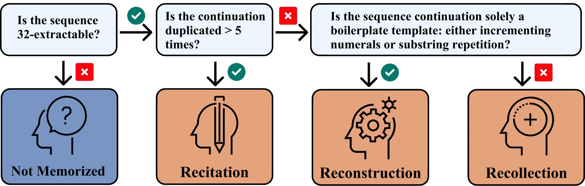

# Semantic Memorization

This repository is for EleutherAI's project Semantic Memorization which defines a unique taxonomy for memorized sequences based on factors that influence memorization. For detailed information on how likelihood of a sequence being memorized is dependant on taxonomy, please see our paper [Recite, Reconstruct, Recollect: Memorization in LMs as a Multifaceted Phenomenon](https://arxiv_link_here)

## Contents
- [Semantic Memorization](#semantic-memorization)
    * [Motivation](#motivation)
    * [Taxonomy](#taxonomy)
- [Reproducing Results](#reproducing-results)
    * [Filters](#filters)
    * [Combining Filters](#combining-filters)
    * [Training Taxonomic Model](#training-taxonomic-model)
    * [Plots](#plots)
- [Citation Details](#citation-details)

## Motivation
Memorization in language models is typically treated as a homogenous phenomenon, neglecting the specifics of the memorized data. We instead model memorization as the effect of a set of complex factors that describe each sample and relate it to the model and corpus. To build intuition around these factors, we break memorization down into a taxonomy: recitation of highly duplicated sequences, reconstruction of inherently predictable sequences, and recollection of sequences that are neither. We demonstrate the usefulness of our taxonomy by using it to construct a predictive model for memorization. By analyzing dependencies and inspecting the weights of the predictive model, we find that different factors influence the likelihood of memorization differently depending on the taxonomic category.
## Taxonomy

Our taxonomy, illustrated above, defines three
types of LM memorization based on colloquial de-
scriptions of human memorization. Humans recite
direct quotes that they commit to memory through
repeated exposure, so LMs recite highly duplicated
sequences. Humans reconstruct a passage by re-
membering a general pattern and filling in the gaps,
so LMs reconstruct inherently predictable boiler-
plate templates. Humans sporadically recollect an
episodic memory or fragment after a single expo-
sure, so LMs recollect other sequences seen rarely
during training.

# Reproducing Results
## Filters
### Code vs Natural Language
To train a [natural language vs code classifier](https://huggingface.co/usvsnsp/code-vs-nl), we used [huggingface's training pipeline](https://huggingface.co/docs/transformers/en/main_classes/trainer) on randomly sampled, equal weight subsets of [bookcorpus](https://huggingface.co/datasets/bookcorpus/bookcorpus) and [github-code](https://huggingface.co/datasets/codeparrot/github-code). following hparams were used while training
- learning_rate: 1e-07
- train_batch_size: 256
- eval_batch_size: 1024
- seed: 42
- optimizer: Adam with betas=(0.9,0.999) and epsilon=1e-08
- lr_scheduler_type: linear
- training_steps: 1000

Following this, we used [this script](./working_dirs/orz/classify_code_vs_nl.py) to find probabilities of a sequence being memorized.
### Highly Duplicated Filter
To replicate results of duplication, run the following scripts in a sequence
- [script saving sequence hashes](.working_dirs/orz/sequence_duplication/save_sequence_hashes.py), to save hash of every 32-gram sequence of Pile
- [script saving zero offset hashes](.working_dirs/orz/sequence_duplication/save_zero_offset_duplicate_hashes.py) Script saving hashes of only required offset (32 in our case)
- [script saving approximate duplicates, based on hashes](.working_dirs/orz/sequence_duplication/calculate_asymptotic_duplicates.py). We now have a single numpy file that stores hashes and sequence ids of all sequences whose hashes are the same as atleast one of zero offset sequence's hashes
- [script calculating exact duplicates](.working_dirs/orz/sequence_duplication/save_true_duplicate_counts.cpp) This script compares each sequence with all sequences with same hash to get exact count of duplicates. 
- Following this, you get a list of true counts, you can combine them use [this script](.working_dirs/orz/sequence_duplication/save_true_duplicates.py)
- You can find already processed list of sequence ids with their count of duplicates in [standard](https://huggingface.co/datasets/usvsnsp/duped-num-duplicates) and [deduped](https://huggingface.co/datasets/usvsnsp/deduped-num-duplicates) datasets.
### Templating (Incrementing and Repeating Filters)

### Semantic and Textual Matches Filter
To replicate semantics and textual matches filter, run the following scripts in a sequence:
- Create sentence embeddings for various datasets, with [this script](./working_dirs/rintarou/sentence_embedding_maker.py)
- Compute semantic filter counts with [this script](./working_dirs/rintarou/snowclones_maker.py)
- Compute textual matche counts with [this script](./working_dirs/rintarou/templating.py). for texual macthes, we also need to create only query sentences for each partition as we compare levestein distance between queries for this filter. This can be acheived by [this script](working_dirs/rintarou/query_maker.py). 
  
### Token frequencies
To replicate results of token frequences, run [this script](.working_dirs/orz/token_frequencies/calculate_token_frequencies.cpp). Full list of token frequencies can be found on huggingface for [standard](https://huggingface.co/datasets/usvsnsp/duped-num-frequencies) and [deduped](https://huggingface.co/datasets/usvsnsp/deduped-num-frequencies) datasets.

## Combining Filters
To combine all the existing filters, run [combine metrics script](calculate_metrics.py). You will need to setup an appropriate JDK and install all requirements to run the script. Filter results can be found on [this huggingface dataset](https://huggingface.co/datasets/usvsnsp/semantic-filters)
## Training Taxonomic Model
To train taxonomic model and launch greedy taxonomic search, launch [this script](model_training.py)
## Plots
- To replicate results on taxonomic model performance, and plots on model weights refer to [this notebook](./plotting/model_perf_testing.ipynb).  
- For results on correlation coefficients, refer to [this notebook](./plotting/Correlation_Coefficients.ipynb)
- For plot on optimal thresholds for code-classifier, refer to [this notebook](.working_dirs/alvin/code_classifier_evaluation/memorization_eval_analysis.ipynb)
## Citation Details
